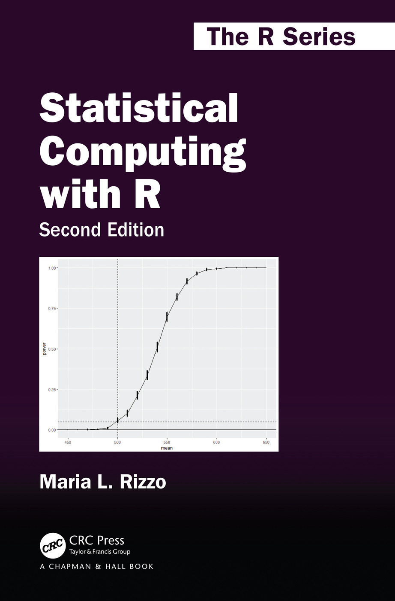

# Statistical Computing with R
Computational statistics and statistical computing are two areas within statistics that may be broadly described as computational, graphical, and numerical approaches to solving statistical problems. [Statistical Computing with R](https://www.amazon.com/Statistical-Computing-Second-Chapman-Hall/dp/1466553324), Second Edition covers the traditional core material of these areas with an emphasis on using the R language via an examples-based approach. The new edition is up-to-date with the many advances that have been made in recent years.

---

Features:
- Provides an overview of computational statistics and an introduction to the R computing environment.
- Focuses on implementation rather than theory.
- Explores key topics in statistical computing including Monte Carlo methods in inference, bootstrap and jackknife, permutation tests, Markov chain Monte Carlo (MCMC) methods, and density estimation.
- Includes new sections, exercises and applications as well as new chapters on resampling methods and programming topics.
- Includes coverage of recent advances including R Studio, the tidyverse, knitr
and ggplot2
- Accompanied by online supplements available on GitHub including R code for all the exercises as well as tutorials and extended examples on selected topics.